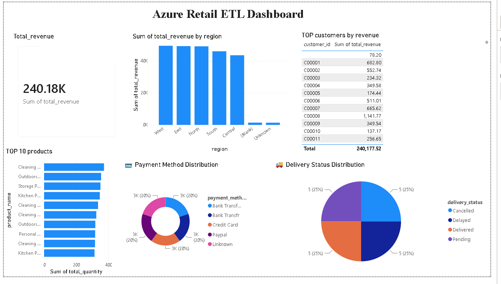

# Azure Retail ETL Pipeline

## Project Overview

This project demonstrates an end-to-end Azure Data Engineering pipeline built using Azure cloud services. The pipeline ingests retail data, performs data cleansing and transformations using PySpark in Azure Databricks, stores data using the Medallion Architecture (Bronze, Silver, Gold), and visualizes business insights in Power BI.

---

## Architecture

```
CSV Files
      │
      ▼
Azure Data Lake Storage Gen2
      │
      ▼
Azure Data Factory
      │
      ▼
Azure Databricks (PySpark)
      │
 Bronze → Silver → Gold
      │
      ▼
Power BI Dashboard
```

---

## Technology Stack

- Azure Data Factory
- Azure Data Lake Storage Gen2
- Azure Databricks
- Apache Spark (PySpark)
- Delta Lake
- Power BI
- Git & GitHub

---

## Dataset

The project uses three retail datasets:

- Customer Information
- Product Information
- Sales Data

---

## Project Structure

```
azure-retail-etl-pipeline
│
├── ADF
├── Architecture
├── Dataset
├── Databricks
├── Images
├── PowerBI
└── README.md
```

---

## ETL Workflow

### Bronze Layer

- Read raw CSV files
- Store raw data in Delta format

### Silver Layer

- Remove duplicate records
- Handle missing values
- Standardize text values
- Clean delivery status
- Convert date formats
- Trim spaces

### Gold Layer

Created business-ready datasets:

- Sales Summary
- Region Revenue
- Top Products
- Customer Revenue
- Payment Summary
- Delivery Summary

---

## Power BI Dashboard

The dashboard provides:

- Total Revenue
- Revenue by Region
- Top 10 Products
- Top Customers by Revenue
- Payment Method Distribution
- Delivery Status Distribution

Dashboard Screenshot



---

## Business Insights

- Identify highest revenue generating regions.
- Analyze customer purchasing behavior.
- Discover top selling products.
- Monitor payment method usage.
- Track delivery performance.

---

## Key Features

- End-to-End Azure ETL Pipeline
- Medallion Architecture
- Delta Lake
- Azure Databricks Transformations
- Azure Data Factory Orchestration
- Power BI Dashboard
- Version Control using GitHub

---

## How to Run

1. Upload datasets into Azure Data Lake Storage Gen2.
2. Execute Azure Data Factory pipeline.
3. Run Databricks notebooks.
4. Generate Gold layer Delta tables.
5. Connect Power BI to Azure Databricks.
6. Refresh dashboard.

---

## Future Enhancements

- Incremental Data Loading
- Slowly Changing Dimensions (SCD Type 2)
- Metadata Driven ETL
- Pipeline Logging
- Error Handling
- CI/CD Integration
- Azure Key Vault Integration

---

## Author

Reddy Sekhar

GitHub:
https://github.com/reddy-sekhar-dev

LinkedIn:
https://www.linkedin.com/in/reddy-sekhar-401184401/
